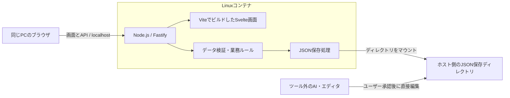

# TaskOtter 技術構成・アーキテクチャ

作成日：2026-10-02  
対象：初版の技術選定と設計方針

## 1. 本書の位置づけ

機能と対象範囲の正本は [`要件.md`](要件.md) とする。本書は、要件を実現する技術、構成、保存・検証・起動の方針を定める。

画面の見た目と構成は [`../ツールイメージ/task-manager-prototype.html`](../ツールイメージ/task-manager-prototype.html) を基準とする。試作のHTML・CSSを参考に、画面とデータ処理をSvelteの部品へ移す。

対話で合意したMac対応も本書の対象とする。`要件.md` 第2節にはMac対応とホスト側保存先を反映済み。2026-10-02にMacのApple containerでの起動・画面確認が利用者から報告された。保存・接続制限・性能の確認とは区別する。

本書は技術選定の確定と、実装方針の合意を記録する。実機での動作・性能が検証済みであることを意味しない。

## 2. 採用する技術

| 役割 | 採用技術・方式 | 採用理由 |
| --- | --- | --- |
| 実装言語 | TypeScript | 画面・API・業務ルールを同じ言語で記述し、データの扱いを型で確認できる |
| 画面 | Svelte | HTMLに近い記法で試作を部品化し、画面状態と表示を管理できる |
| 開発・画面ビルド | Vite | Svelteの開発サーバーと本番用の静的ファイル生成を行う |
| サーバー実行環境 | Node.js | API、静的ファイル配信、ホストのJSONファイルへのアクセスを担う |
| ローカルAPI | Fastify | APIのルーティング、入力検証、エラー応答をまとめて扱える |
| 静的ファイル配信 | `@fastify/static` | ビルド済み画面をAPIと同じプロセス・ポートから配信する |
| データ仕様 | JSON Schema | 保存データの仕様を、AIやエディタからも参照できる独立したファイルにする |
| 実行時の形式検証 | Ajv | API入力と保存ファイルをJSON Schemaに照らして検証する |
| 日付等の形式検証 | `ajv-formats` | Schemaの `date` 等の形式を検証する。項目間の比較は別途実装する |
| データ保存 | 単一JSONファイル | Task・Outcomeをまとめ、外部AIから直接読み書きできるようにする |
| イメージ定義 | `Containerfile` | アプリと実行環境をLinuxコンテナにまとめる |
| Windowsの起動 | PowerShellからWSL組み込みの `wslc.exe` | Ubuntu・Docker Desktop・Docker Engineの別途導入を前提としない |
| Macの起動 | Appleの `container` | Apple Silicon上で同じイメージ定義からLinuxコンテナを実行する |

Node.jsは採用時点でサポートされるLTS版を選ぶ。ライブラリの具体的なバージョンは実装開始時に互換性を確認して固定し、npmのロックファイルを管理する。

SvelteKitは採用せず、画面はSvelte＋Vite、APIはFastifyで構成する。データベース、専用の状態管理ライブラリ、コンテナの複数サービス構成は初版の前提としない。

## 3. 全体構成



普段の利用では、Node.jsの1プロセスが画面とAPIを配信する。Viteの開発サーバーは常駐させない。ブラウザに画面を配信した後、一覧・ダッシュボード・ガント・カレンダーの切り替えと表示の計算は主にブラウザ側で行う。

ホスト側にNode.jsやアプリの依存ライブラリをインストールせず、コンテナ内にまとめる。ホスト側にはコンテナ実行ツール、アプリのソースまたは配布物、指定したデータディレクトリ、コンテナツールが管理するイメージ等が残る。

## 4. 責務とコード構成

| 部分 | 主な責務 |
| --- | --- |
| 画面 | Task・Outcome一覧、ダッシュボード、ガント、カレンダー、編集フォーム、警告・エラー表示 |
| API | 読み込み・変更要求の受付、入力検証、業務処理の呼び出し、応答・エラーの整形 |
| 業務ルール | 完了条件、削除時の紐づけ解除、期間判定、はみ出し判定など |
| 保存処理 | ファイルの読み込み、構文検証、書き込みの直列化、一時ファイルと置き換え |
| 共通定義 | JSON Schema、データの型、ステータス等の定数、日付・期間の判定 |

予定するディレクトリ構成は次のとおり。細かなファイル名は実装時に調整する。

```text
src/
  frontend/             Svelte画面、部品、画面状態
  server/
    api/                APIのルート
    services/           データ変更と業務ルール
    storage/            JSONファイルの読み書き
  shared/               共通の型、定数、日付・期間判定
schemas/
  taskotter.schema.json 保存データのJSON Schema
scripts/                Windows・Mac向けの起動・停止手順
tests/                  業務ルール、保存処理、ブラウザ操作の検証
Containerfile           共通のコンテナイメージ定義
package.json
package-lock.json
```

Node.jsのファイル操作やコンテナ固有の設定を画面や業務ルールへ持ち込まず、保存処理と起動設定に置く。将来の保存先変更で、画面と業務ルールを再利用しやすくする。

## 5. JSONの仕様と検証

### 5.1 保存データ

Task、Outcome、時刻選択間隔などの設定を一つのJSONファイルに保持する方針とする。仕様変更を識別するための `schemaVersion` を設ける。

Task・Outcomeには名前と独立した識別子を付け、TaskからOutcomeの識別子を参照する。任意項目の未設定、期間の「以前・以降」、日付・時刻の正確な表現は、JSON仕様を作成する際に確定する。

日付と時刻は、それぞれ `YYYY-MM-DD` と `HH:mm` を基本に検討する。締切日や対応期間をUTC日時に変換して保存する必要はない。日付だけの値と日時を区別し、ブラウザやコンテナのタイムゾーンによる日付のずれを防ぐ。

「今日」の判定に使うタイムゾーンは明示的に決める。コンテナの既定タイムゾーンに依存させない。

### 5.2 検証の分担

JSON Schemaを保存形式の正本とし、TypeScriptの型との二重定義によるずれを防ぐ。型をSchemaから得る具体的な方法は実装時に決定する。

| 検証段階 | 検証する内容の例 |
| --- | --- |
| JSON構文 | JSONとして読み込めること |
| JSON Schema＋Ajv | 必須項目、値の型、ステータス・優先度の選択肢、日付・時刻の形式、期間の両端の指定 |
| TypeScriptの業務ルール | IDの重複、存在しないOutcomeへの参照、期間・時刻の前後関係、Outcomeの完了条件 |
| 画面の警告 | Taskの期間がOutcomeの期間からはみ出していること。保存は可能とする |

保存ファイルの検証では、不正な値を型変換して受け入れたり、不明な項目を黙って削除したりしない。定義した仕様に適合しない場合はエラーとして扱う。

FastifyのAPI入力検証と、ディスク上のJSONの検証は別の呼び出しが必要である。保存ファイルはAPIの入力検証を通っただけでは安全と判断せず、共通のファイル検証処理を必ず呼び出す。

## 6. 読み込み・変更・保存

### 6.1 読み込み

ブラウザを開いたときと再読み込みしたとき、APIが保存先のJSONを読み、構文・形式・業務ルールを検証して画面へ返す。外部の更新を隠すサーバー側キャッシュやブラウザ側の永続キャッシュは初版の前提としない。

不正なJSONを検知した場合は、問題の場所と内容を画面に表示し、編集・保存を無効にする。API側も保存要求を拒否する。元のJSONを空データで置き換えたり、不正な内容を自動修正して保存したりしない。ファイルを修正して正常に再読み込みできた後に操作を再開する。

初回の空データ作成と、運用中にファイルが消えた場合の扱いは区別する。具体的な初期化手順は実装時に定める。

### 6.2 変更

APIは追加・更新・削除などの操作を受け付ける。ブラウザが持つ全件データを毎回丸ごと保存する方式ではなく、対象データへの操作を基本とする。

1. APIへの入力を検証する。
2. 現在の保存ファイルを読み、検証する。不正ならここで止める。
3. 対象の変更と必要な業務処理を行う。例えば、未完了Taskへの変更時にOutcomeの完了フラグを外す。
4. 変更後の全体データを再検証する。
5. ファイルへ保存し、変更後のデータを画面へ返す。

編集の競合検知、変更差分の統合、外部AIとの排他制御は初版に追加しない。後から保存した内容を優先する。更新対象のどの項目を送信するかはAPI仕様で明文化する。

### 6.3 保存時の保護

アプリ内の複数の保存要求は直列に処理する。保存先と同じディレクトリの一時ファイルに書き込み、正常終了後に本来のファイルを置き換える方式を基本とする。

この方式で途中失敗によるファイル破損の可能性を減らす。ただし、Windows・Macのマウント先での置き換え動作と、失敗時に元ファイルを維持できることは実機で確認する。外部AIの書き込みはアプリ内の直列化の対象にならない。

コンテナ削除後も、ホスト側の保存データは残る。削除済みTask・Outcomeの復元は、要件どおり外部のファイルバックアップで行う。

## 7. 画面の実装方針

Svelteの画面状態として取得したTask・Outcomeを管理し、一覧・ダッシュボード・ガント・カレンダーで共有する。絞り込みや表示順の変更はブラウザ側で行う。専用の状態管理ライブラリは必要性が出た場合に検討する。

初版のガント・カレンダーは、SvelteとHTML/CSSを使った独自実装を基本案とする。特にガントは、独立したOutcome期間、バーなしの行、無期限の両端、期間のはみ出し警告を直接表現する。

カレンダーでは、同じ時間帯に重なる予定や月表示で多数の予定がある場合にも、データを見落とさない表示方法を設計する。実装の複雑さや性能の問題が具体化した場合に、専用ライブラリの採否を判断する。

日付選択、15分・30分間隔の時刻ポップアップ、編集サイドバーは共通部品として作る。フォームの入力エラーと、保存可能な期間の警告を区別する。

## 8. コンテナと起動

### 8.1 共通構成

ビルド段階でTypeScriptとSvelte画面をコンパイルし、実行段階にはNode.js、サーバー、画面の静的ファイル、実行時の依存関係を含める。起動時にデータディレクトリをコンテナ内の `/data` にマウントする。

保存先と公開ポートは起動時に指定する。保存先を変更する場合は再起動する。APIと画面を同じオリジンで配信し、同じPCからの接続に限定する。

コンテナ内のサーバーの待ち受けと、ホスト側のポート公開は別の設定として扱う。コンテナ内で到達可能な待ち受けにした上で、ホスト側でループバックへの公開を設定・検証する。ブラウザのURLが `localhost` であることだけでは、LANからの接続制限を確認したことにはならない。

共通の `Containerfile` を用い、WindowsのCPUに合わせたLinuxイメージと、Apple Silicon向けのLinux ARM64イメージをビルドできるようにする。同じイメージ定義を使うことと、CPUに依存する同一のイメージをそのまま使うことは区別する。

### 8.2 Windows

- Windows PowerShell 5.1／PowerShell 7から `scripts/run-windows.ps1` を実行し、WSL組み込みの `wslc.exe` を直接使用する。Ubuntuは必須としない。
- Microsoft Learnの機能最小バージョンはWSLパッケージ2.9.3。2026-10-02確認時点の最新安定版は3.0.1で、`wsl --update` で安定版へ更新する方針。[公式リリース](https://github.com/microsoft/WSL/releases/tag/3.0.1)、[正式公開の案内](https://blogs.windows.com/windowsdeveloper/2026/09/29/wsl-containers-now-generally-available/) を参照。
- Windows上の保存ディレクトリをドライブ付き絶対パスで指定し、/dataにマウントする。ビルド時はスクリプトの位置からプロジェクトルートを特定する。
- CLIには引数配列で渡し、空白・日本語を含むパスを一つの引数として保つ。外部コマンドの終了コードを確認し、失敗時に起動成功とは表示しない。
- 既存のrun-windows.shはWSLパスを変換してPowerShellへ渡す互換入口に限定する。
- Windows実機でビルド・マウント・保存・停止再開・接続制限・性能を検証する。LinuxのPowerShellによる引数検証だけでは実機確認済みと扱わない。

### 8.2.1 WSL Ubuntu + Docker Engine（代替）

- run-wsl-docker.shをUbuntuから実行し、ローカルDocker Engineで共通Containerfileを利用する。wslc.exeは呼ばない。
- コンテナ名はtaskotter-dockerとし、Windows PowerShellのtaskotterとは区別する。ポート公開は127.0.0.1:<port>:3000。
- 保存先をLinux絶対パスへ解決して/dataへマウント。実行UID/GIDはUbuntu利用者のものとする。TASKOTTER_DOCKER_SUDO=1指定時はDockerコマンドだけsudoで実行する。
- 導入とsystemd、既存保存ファイルの引き継ぎは[Docker起動手順](../docs/wsl-docker.md)に記載。Docker実機の保存・接続は別途確認する。

### 8.3 Mac

- Appleの `container` を利用する。公式のサポート条件はApple SiliconとmacOS 26。
- Mac上の保存ディレクトリをコンテナへマウントする。
- Windowsと共通のアプリを使い、Mac向けのビルド・起動・停止手順を用意する。

### 8.4 開発中

開発時にはViteの画面サーバーとFastifyのAPIを分けて起動し、画面側の `/api` 要求をAPIへ転送する。本番利用ではビルド済み画面をFastifyから配信する。

ホスト環境へ依存ライブラリを入れない方針に合わせ、開発・検証用のコマンドもコンテナ内で実行できるようにする。

## 9. 将来のクラウド配置に備える範囲

Cloudflare・Amplifyへの配置は将来候補とする。Svelte＋Viteの画面は静的ファイルとして配信できるため、ローカルAPIから画面を切り離して配置できる構成にする。

業務ルールとJSON検証は保存方式から独立させ、ローカルファイル保存をR2・S3などの保存処理へ差し替えやすくする。ただし、クラウド側の一時ファイル領域を永続保存先として扱わない。

クラウド移行では、APIの実行環境、保存先、認証、複数端末からの更新、外部AIのデータアクセス方法を改めて設計する。FastifyサーバーとローカルJSONをそのまま配置できるとは想定しない。初版でクラウド用の実装を先行して追加する必要はない。

## 10. 検証方針と実装前の確認

最初に小さなAPIとJSON読み書き処理をコンテナで動かし、Windows・Macそれぞれでホスト側の保存先へのアクセスと、同じPCのブラウザからの接続を確認する。その後、画面と機能の実装を進める。

| 対象 | 確認すること |
| --- | --- |
| 起動環境 | イメージのビルド、起動・停止、ホスト側保存先の指定、同じPCへの接続限定 |
| 保存 | 再起動・コンテナ削除後のデータ保持、保存失敗時の元ファイル保護 |
| 外部更新 | AIが追加・変更したJSONを再読み込みで反映できること |
| 不正データ | 構文・形式・参照等のエラー表示、保存拒否、修正後の操作再開 |
| 業務ルール | Outcome完了条件と自動解除、削除時の紐づけ解除、無期限期間、日付・時刻の境界 |
| 画面 | 必須画面・絞り込み・編集・警告、カレンダーの予定の重なりと多数表示 |
| 性能 | 数百件で、起動済みアプリの初回一覧表示と各画面切り替えがそれぞれ5秒以内 |

業務ルール・保存処理には自動テストを用い、主要なブラウザ操作にはブラウザテストを用いる。候補はVitestとPlaywrightとし、コンテナでの実行方法と対応環境を確認して採用する。

Windowsでは実際に使うWindows上の保存先で性能を測る。Macでも同じデータ規模で測る。コンテナの起動・ビルド時間は、要件の「起動済みアプリをブラウザで開く時間」と区別して記録する。

実装前に確定する詳細は、JSON仕様、APIの入力・応答、初期化手順、タイムゾーン、画面の大量データ表示方法、具体的なライブラリバージョンと起動コマンドである。

## 11. 公式資料

- [Svelte概要](https://svelte.dev/docs/svelte/overview)
- [SvelteのTypeScript対応](https://svelte.dev/docs/svelte/typescript)
- [Vite](https://vite.dev/guide/)
- [Fastifyの検証とシリアライズ](https://fastify.dev/docs/latest/Reference/Validation-and-Serialization/)
- [Ajvの形式検証](https://ajv.js.org/guide/formats.html)
- [WSLコンテナー](https://learn.microsoft.com/ja-jp/windows/wsl/wsl-container?tabs=csharp)
- [WSLコンテナーの利用手順](https://learn.microsoft.com/ja-jp/windows/wsl/tutorials/wsl-containers)
- [WSLとWindowsの相互運用](https://learn.microsoft.com/en-us/windows/wsl/interop)
- [Apple containerの要件](https://github.com/apple/container/blob/main/README.md)
- [Apple containerのコマンド](https://github.com/apple/container/blob/main/docs/command-reference.md)
- [Apple containerのマウント](https://github.com/apple/container/blob/main/docs/volumes.md)
- [Cloudflare Workersのファイル領域](https://developers.cloudflare.com/workers/runtime-apis/nodejs/fs/)
- [Amplify Hostingの実行環境](https://docs.aws.amazon.com/amplify/latest/userguide/ssr-deployment-specification.html)

## 12. 2026-10-02のUI変更

日付選択は共通のDatePickerコンポーネントで行う。入力欄全体を一つのボタンにし、日曜始まりのカレンダー、月移動、今日・解除、キーボード選択を提供する。ガントと日・週カレンダーは共通の日付整形関数で `M/D(曜)` を表示する。

共通編集サイドバーはモーダルdialogを用い、外側のクリックで閉じ、左端のポインタードラッグ／キーボードで幅を変更する。幅は現在の画面幅で制限し、同じページを開いている間は保持する。期間未設定の表示は `-` に統一した。保存データとAPIの仕様は変更しない。
